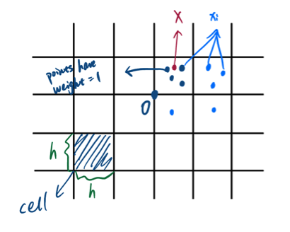

# Plug-in Classifiers (Similarity Classifier)

For binary classification with 0-1 loss:

1. $\mathfrak f_B(x)$ = $\begin{cases}1 & if ~P_{(X,Y) \in \rho}(Y=1 \mid X=x) \geq P_{(X,Y) \in \rho}(Y=0 \mid X=x)\\0 & o.w.\end{cases}$ is *Motivate "plug-in" or similarity classifier*;

1. $\mathfrak f_B \in \underset{\mathfrak f: \mathcal X \to \{0,1\}}{\operatorname{argmin}} ~ P(\mathfrak f(X) \neq Y)$ is *Motivate ERM (Empirical Risk Minimization)*.

For this chapter, we will talk about the first one.

Define $\eta(x) := P(Y=1 \mid X=x)$, then we can rewrite $\mathfrak f_B(x)$ as: $\mathfrak f_B(x) = \begin{cases}1 & \eta(x) \geq \frac{1}{2}\\0 & o.w.\end{cases}.$

Idea: Replace $\eta(x)$ with $\hat \eta_n(x)$ that is built from our training data $(x_1,y_1), \cdots, (x_n,y_n)$: $\hat{\mathfrak f}_n(x) = \begin{cases}1 & \hat \eta_n(x) \geq \frac{1}{2}\\0 & o.w.\end{cases}.$

:::{.lemma #base}
Let $\mathfrak f$ be an arbitrary binary classifier. Then 

$$
0 \leq R(\mathfrak f) - R_B^* = E\Big[\mid 2 \eta(X) - 1 \mid \cdot 1_{\mathfrak f(X) \neq \mathfrak f_B(X)}\Big] \leq 2 E\Big[ \mid \eta(X) - \alpha(X) \mid \Big],
$$

where we suppose $\mathfrak f(X) = \begin{cases}1 & \alpha(X) \geq \frac{1}{2}\\0 & o.w.\end{cases}.$
:::

:::{.proof}
As 

$$
\begin{aligned}
E[1_{\mathfrak f(X) \neq Y} - 1_{\mathfrak f_B(X) \neq Y} \mid X] &= (1_{\mathfrak f(X) \neq 1} - 1_{\mathfrak f
_B(X) \neq 1}) \cdot P(Y=1 \mid X) + (1_{\mathfrak f(X) \neq 0} - 1_{\mathfrak f
_B(X) \neq 0}) \cdot P(Y=0 \mid X)\\
&= (1_{\mathfrak f(X) \neq 1} - 1_{\mathfrak f
_B(X) \neq 1}) \cdot \eta(X) + (1_{\mathfrak f(X) \neq 0} - 1_{\mathfrak f
_B(X) \neq 0}) \cdot (1-\eta(X))\\
&= \begin{cases}
0 & if ~ \mathfrak f(X) = \mathfrak f_B(X) = 1\\
0 & if ~ \mathfrak f(X) = \mathfrak f_B(X) = 0\\
\mid 1-2\eta(X) \mid & if ~ \mathfrak f(X) =1,~ \mathfrak f_B(X) = 0\\
\mid 2\eta(X)-1 \mid & if ~ \mathfrak f(X) =0,~ \mathfrak f_B(X) = 1\\
\end{cases}\\
&= \mid 2\eta(X)-1 \mid \cdot 1_{\mathfrak f(X) \neq \mathfrak f_B(X)},
\end{aligned}
$$

we have:

$$
\begin{aligned}
R(\mathfrak f) - R_B^* &= E\Big[E[1_{\mathfrak f(X) \neq Y} - 1_{\mathfrak f_B(X) \neq Y} \mid X] \Big]\\
&= E\Big[\mid 2 \eta(X) - 1 \mid \cdot 1_{\mathfrak f(X) \neq \mathfrak f_B(X)}\Big].
\end{aligned}
$$

Moreover, 

- Case1: $\mathfrak f(X) \neq \mathfrak f_B(X)$, $\eta(X) < \frac{1}{2}$  
In this case, $\mathfrak f_B(X) = 0$ and $\mathfrak f(X) = 1$, which means that $\alpha(X) \geq \frac{1}{2}$. So, $2 \mid \eta(X) - \frac{1}{2} \mid \leq 2 \mid \eta(X) - \alpha(X) \mid$.

- Case 2: $\mathfrak f(X) \neq \mathfrak f_B(X)$, $\eta(X) \geq \frac{1}{2}$  
Similarly, we have $2 \mid \frac{1}{2} - \eta(X) \mid \leq 2 \mid \eta(X) - \alpha(X) \mid$.

Thus, $E\Big[\mid 2 \eta(X) - 1 \mid \cdot 1_{\mathfrak f(X) \neq \mathfrak f_B(X)}\Big] \leq 2E\Big[\mid \eta(X) -\alpha(X) \mid \cdot 1_{\mathfrak f(X) \neq \mathfrak f_B(X)}\Big].$
:::

:::{.corollary #base}
If $\hat{\mathfrak f}_n(X) = \begin{cases}1& if~ \hat \eta_n(X) \geq 1/2 \\0 & o.w.\end{cases}$, $\hat \eta_n(X) = \hat \eta_n (X; (x_1, y_1), \cdots, (x_n, y_n))$, then 

$$
E[R(\hat{\mathfrak f}_n)] - R^*_B \leq 2 E\Big[\mid \eta(X) - \hat \eta_n(X) \mid\Big].
$$
:::

:::{.remark} 
For $\hat{\mathfrak f}_n$, $\eta(X)$, and $\hat \eta_n(X)$, we have $(X, Y) \sim \rho$ and $(x_1, y_1), \cdots, (x_n, y_n) \sim \rho$.
:::

:::{.proof}
Given $(x_1, y_1), \cdots, (x_n, y_n)$, according to **Lemma \@ref(lem:base)**, we have: $R(\hat{\mathfrak f}_n) - R^*_B \leq 2 E\Big[\mid \eta(X) - \hat \eta_n(X) \mid\Big]$.
:::

In general, we are interested in building classifier from observation $(x_1, y_1), \cdots, (x_n, y_n)$: $\hat {\mathfrak f}_n: ~\mathcal X \to \{0,1\}$, $\hat {\mathfrak f}_n (X) \in \{0,1\}$.

-----

:::{.example #data name="Dependency on Data"}
Given $(x_1, y_1), \cdots, (x_n, y_n)$, 

$$
\hat \eta_n(X) := \frac{\sum_{i=1}^n Y_i exp(-\mid X_i - X \mid ^2 / r_n^2)}{\sum_{i=1}^n exp(-\mid X_i - X \mid ^2 / r_n^2)}.
$$

Then we have:

$$
\hat {\mathfrak f}_n(X; (x_1, y_1), \cdots, (x_n, y_n)) = 
\begin{cases}
1 & if ~\hat \eta_n(X) \geq \frac{1}{2}\\
0 & o.w.
\end{cases}
$$
:::

-----

:::{.remark}
$\hat \eta_n(X) \in [0,1]$.
:::

***Goal***: To build $\hat{\mathfrak f}_n$ in such a way that $R(\hat{\mathfrak f}_n) - R^*_B$ goes to 0 as $n \to \infty$.

## Notions of Consistency for Families of Binary Classifier

1. We say that $\{\hat{\mathfrak f}_n\}_{n\in N}$ is ***consistent*** for the distribution $\rho$, if we have:  
$$
\underset{n \to \infty}{\operatorname{lim}} (E_{(x_1, y_1), \cdots, (x_n, y_n)} [R(\hat{\mathfrak f}_n)] - R^*_B) = 0
$$  

:::{.remark}
- $(x_1, y_1), \cdots, (x_n, y_n) \underset{i.i.d}{\sim} \rho$.
  
- $R^*_B = \underset{\mathfrak f}{\operatorname{min}} P_{(X,Y) \sim \rho} [\mathfrak f(X) \neq Y]$.
  
- $R(\hat{\mathfrak f}_n) = P_{(X,Y) \sim \rho} [\hat{\mathfrak f}_n(X) \neq Y]$.
:::

2. We say that $\{\hat{\mathfrak f}_n\}_{n\in N}$ is ***strongly consistent*** for the distribution $\rho$, if we have:  
$$
\underset{n \to \infty}{\operatorname{lim}} (R(\hat{\mathfrak f}_n) - R^*_B) = 0, ~\text{with probability 1 (almost sure convergence).}
$$

-----

:::{.example #student name="Conceptual Explaination"}
Assume we have M students.Then for student m, we have:

$$
\begin{cases}
(x_1^m, y_1^m), \cdots, (x_n^m, y_n^m) \underset{i.i.d}{\sim} \rho\\
\text{The plug-in classifier}: ~\hat{\mathfrak f}_n^m (\cdot ~;(x_1^m, y_1^m), \cdots, (x_n^m, y_n^m))\\
\text{Risk: }R(\hat{\mathfrak f}_n^m) = P_{(X,Y) \sim \rho} [\hat{\mathfrak f}_n^m(X) \neq Y]
\end{cases}.
$$

*Q1 (Consistency)*: Suppose I collect all risks that the class computed: $R(\hat{\mathfrak f}_n^1), \cdots, R(\hat{\mathfrak f}_n^M)$, and suppose I average them: $\frac{1}{M} \sum_{m=1}^M R(\hat{\mathfrak f}_n^m) \approx E_{(x_1, y_1), \cdots, (x_n, y_n)} [R(\hat{\mathfrak f}_n)]$. Is it true that as $n \to \infty$, this ***average*** risk goes to $R^*_B$.

*Q2 (Strong Consistency)*: Is it true that for ***each*** $m$, we have that $R(\hat{\mathfrak f}_n)$ converges to $R^*_B$ as $n \to \infty$.
:::

-----

3. We say that a family $\{\hat{\mathfrak f}_n\}_n$ is ***universal (strong) consistent*** if $\{\hat{\mathfrak f}_n\}_n$ is (strong) consistent for all $\rho$.

-----

:::{.example #uni name="Universality in Statistical Inference"}
Let $\mu$ be a probability distribution over $R$ with well defined first moment $\theta := E_{Z \sim \mu} (Z)$. The goal is to build an estimator $\hat \theta_n(z_1, \cdots, z_n)$ that is consistent for $\theta$. 

- $\hat \theta_n^1(z_1, \cdots, z_n) = \frac{1}{n} \sum z_i ~(\text{Sample Mean})$, is universal strong consistent.  
$z_1, \cdots, z_n \underset{i.i.d}{\sim} \mu$ for arbitrary $\mu$, by Law of Large Number (Strong LLN), we know that with probability 1, $(\hat \theta_n^1(z_1, \cdots, z_n) - \theta) \to 0$ as $n \to \infty$.

- $\hat \theta_n^2(z_1, \cdots, z_n) = \text{Sample Median}$, is not universal consistent.  
If $\mu$ is a distribution such that its median is not equal to its mean, then it is not true that $(\hat \theta_n^2(z_1, \cdots, z_n) - \theta) \to 0$ as $n \to \infty$. However, $\hat \theta_n^2(z_1, \cdots, z_n)$ is consistent for $\mu = N(1,1)$ whose mean and median are the same.
:::

-----

For the plug-in classifiers, studying (strong) consistency reduce to understanding the following two questions:

- Does $E_{(X,Y) \sim \rho} \Big[\mid \eta(X) - \hat \eta_n(X) \mid \Big]$ converge to 0 as $n \to \infty$, with probability 1?  
If yes, $\{\hat{\mathfrak f}_n\}_n$ is strong consistent for $\rho$.

- Does $E_{(x_1,y_1), \cdots, (x_n,y_n), (X,Y) \sim \rho} \Big[\mid \eta(X) - \hat \eta_n(X) \mid \Big]$ converge to 0 as $n \to \infty$?  
If yes, $\{\hat{\mathfrak f}_n\}_n$ is consistent for $\rho$.

## Functions of \(\hat \eta_n\)

$$
\hat \eta_n(X; (x_1,y_1), \cdots, (x_n,y_n)) = \sum_{i=1}^n y_i \omega_{in} (X; x_1, \cdots, x_n)
$$

where $\omega_{in} (X; x_1, \cdots, x_n)$ is weight that we give to each point $(x_i, y_i)$ and $\sum_{i=1}^n \omega_{in} (X; x_1, \cdots, x_n) = 1$.

In other words, to determine $\hat \eta_n(X)$, we consider weighted averages of the labels $y_1, \cdots, y_n$.

Intuitively the $i$s for which $\omega_{in}$ are larger should be ones for which $x_i$ is more similar to $X$.

-----

:::{.example #weight1 name="Kernel-Based Weights"}

$\mathcal X = R^d$, select a length-scale $r > 0$.

$$
\omega_{in}(X; x_1, \cdots, x_n) = \frac{exp(- \frac{|| X_i - X || ^2}{2r^2}) }{\sum_{i=1}^n exp(-\frac{|| X_i - X || ^2}{2r^2})}.
$$

Points $x_i$ for which $|| X - x_i || \leq r$ will be give higher weight than points that are such that $|| X - x_i || \geq r$.

:::

------

:::{.example #weight2 name="Histogram-Based Weights"}
$\mathcal X = R^d$, select a length-scale $h > 0$.

For $d=2$, we have:

Introduce pre-weights:

Provided there is at least one $x_i$ in the same cell as $X$:

$$
\tilde \omega_{in}(X; x_1, \cdots, x_n) := 
\begin{cases}
1 & \text{if } x_i \text{ and } X ~\text{belong to the same cell}\\
0 & o.w.
\end{cases}
$$
Otherwise we define:

$$
\tilde \omega_{in}(X; x_1, \cdots, x_n) := \frac{1}{n}
$$
Then we have:

$$
\omega_{in}(X; x_1, \cdots, x_n) = \frac{\tilde \omega_{in}(X; x_1, \cdots, x_n)}{\sum_{j=1}^n \tilde \omega_{jn}(X; x_1, \cdots, x_n)}
$$
:::

-----

:::{.example #weight3 name="k-NN Based Weights"}
$k \in [1,n]$

$$
\tilde \omega_{in}(X; x_1, \cdots, x_n) = 
\begin{cases}
1 & \text{if } x_i \text{ is among the k-closest points to } X\\
0 & o.w.
\end{cases}
$$
Then we have:

$$
\omega_{in}(X; x_1, \cdots, x_n) = \frac{\tilde \omega_{in}(X; x_1, \cdots, x_n)}{\sum_{j=1}^n \tilde \omega_{jn}(X; x_1, \cdots, x_n)}
$$

:::

There may be ties, which will be discussed later.

-----

## Consistency

:::{.theorem #stone name="Stone's Theorem"}
Let $\omega_{in}(X; x_1, \cdots, x_n)$ be such that following three conditions hold:

1. $\exists c>0$ such that $\forall \text{non-negative function } g: R^d \to R$, with $E_{(X,y) \sim \rho} [g(X)] < \infty$: $E_{(X, x_1, \cdots, x_n)} [\sum_{i=1}^n \omega_{in} (X) g(x_i)] \leq c ~E_X [g(X)]$;

2. $\forall a > 0$, $\underset{n \to \infty}{\operatorname{lim}} E_{(X, x_1, \cdots, x_n)} [\sum_{i=1}^n \omega_{in}(X) ~1_{|x_i - X| > a}] = 0$ (weights are only relevant or large for $x_i$ close to $X$);

3. $\underset{n \to \infty}{\operatorname{lim}} E_{(X, x_1, \cdots, x_n)} [\underset{i=1,\cdots, n}{\operatorname{max}} \omega_{in}(X)] = 0$.

Then the family of similarity classifiers $\{\hat{\mathfrak f}_n\}_n$ induced by these weights is consistent for $\rho$.

:::

:::{.proof}
\quad
***Goal***: to show that $E_{(X,Y), (x_1,y_1), \cdots, (x_n, y_n)} [|\eta(X) - \hat \eta_n(X)|] \to 0$ as $n \to \infty$.

Introduce $\bar \eta_n(X) := \sum_{i=1}^n \eta(x_i) \omega_{in}(X)$, then

$$
\begin{aligned}
E_{(X,Y), (x_1,y_1), \cdots, (x_n, y_n)} [|\eta(X) - \hat \eta_n(X)|] &\leq E_{(X,Y), (x_1,y_1), \cdots, (x_n, y_n)} [|\eta(X) - \bar \eta_n(X)|] + \\
&\quad E_{(X,Y), (x_1,y_1), \cdots, (x_n, y_n)} [|\bar \eta_n(X) - \hat \eta_n(X)|]\\
&\underset{C.S. Ineq}{\leq} E_{(X,Y), (x_1,y_1), \cdots, (x_n, y_n)} [|\eta(X) - \bar \eta_n(X)|] \text{ ("bias term")}+ \\
&\quad \Big(E_{(X,Y), (x_1,y_1), \cdots, (x_n, y_n)} [|\bar \eta_n(X) - \hat \eta_n(X)|^2]\Big)^2 \text{ ("variance term")}
\end{aligned}
$$

Then show both terms $\to 0$ as $n \to \infty$.

:::

:::{.remark}
1. 
$$
\begin{aligned}
E[\hat \eta_n(X) | X, x_1 \cdots, x_n] &= \sum_{i=1}^n E[y_i | X, x_1, \cdots, x_n] ~\omega_{in}(X)\\
&= \sum_{i=1}^n E[y_i | X, x_1, \cdots, x_n] ~\omega_{in}(X)\\
&= \sum_{i=1}^n E[y_i | x_i] ~\omega_{in}(X)\\
&= \bar \eta_n(X)
\end{aligned};
$$

2. To show that the variance term $\to 0$ as $n \to \infty$, we only need to use condition 3 in the **Theorem \@ref(thm:stone)**;

3. To show that the bias term $\to 0$ as $n \to \infty$, we only need to use conditions 1 and 2 in the **Theorem \@ref(thm:stone)**.

:::

:::{.example #weight1-2 name="Continuation of Example \@ref(exm:weight2)"}

Let $h^d = h_n^d$. If $n h_n \to \infty$ as $n \to \infty$, and if $h_n^d \to 0$ as $n \to \infty$, then the family of histogram classifiers $\{\hat {\mathfrak f}_{n, h_n}\}_{n \in N}$ is universally consistent.

Conditions of the Stones Theorem:

1. Technical Assumption.

2. Locality ($h = h_n \to 0$ as $n \to \infty$).

3. No weight dominates the others. (For every $X$, we should use a growing number of training data points to make a prediction, i.e. the expected number of points in a cell $nh_n^d \to \infty$ as $n \to \infty$)

For example, let $\rho = Uniform$, $N_X = \#\{x_i ~s.t. ~x_i \in Cell(X)\}$, then $N_X \sim Binomial(n, P_h)$, where $P_h = P(x_i \in Cell(X)) \propto h^d$. As a result, $E(N_X) \propto nh^d$.

:::

:::{.example #weight1-3 name="Continuation of Example \@ref(exm:weight3)"}

- $k \to \infty$ (locality)

- $\frac{k}{n} \to 0$ (Related to condition 3 in Stone's Theorem)
:::

## Strong Consistency 
### Theorems from probability theory:

:::{.theorem #slln name="Strong Law of Large Numbers"}
Let $Z_1, Z_2, \cdots$ be $i.i.d$ real valued random variables, and $E(Z_i) = m$. Then $\frac{1}{n} \sum_{i=1}^n (Z_i - m) \to 0$ almost surely as $n \to \infty$.

:::

:::{.theorem #clt name="Central Limit Theorem"}
(It quantifies in a sense how fast is the convergence in the LLN)

Suppose $Var(Z_i) = \sigma^2 < \infty$ for $\{Z_i\}$ in ***Theorem \@ref(thm:slln)*** , then $\sqrt n (\frac{1}{n} \sum_{i=1}^n (Z_i - m)) \underset{d}{\to} N(0, \sigma^2)$.

Recall, what this means is that $\forall t\in R$, we have:

$$
\underset{n\to \infty}{\operatorname{lim}} P(\frac{\sqrt n}{\sigma} [\frac{1}{n}\sum_{i=1}^n (Z_i - m)] > t) = \int_t^\infty \frac{e^{-s^2/2}}{\sqrt {2\pi}} ds = 1-F(t)
$$
:::

:::{.remark}
CLT is still asymptotic (渐近的).
:::

:::{.theorem #bet name="Berry-Essen Theorem"}
(It is a quantitative and non-asymptotic version of CLT)

$\forall t$, we have:
$$
\Big| P(\frac{\sqrt n}{\sigma} [\frac{1}{n}\sum_{i=1}^n (Z_i - m)] \geq t) - \int_t^\infty \frac{e^{-s^2/2}}{\sqrt {2\pi}} ds \Big| \leq \frac{c \gamma}{\sigma^3 \sqrt{n}},
$$ 

where $\gamma = E(|Z_1|^3) < \infty$.
:::

:::{.remark}
Berry-Essen Theorem doesn't provide very precise information about $P(\frac{\sqrt n}{\sigma} [\frac{1}{n}\sum_{i=1}^n (Z_i - m)] \geq t)$ when $t$ is very large.
:::

### Concentration Inequalities

***Goal***: To quantify precisely what is the behavior of $P(\frac{\sqrt n}{\sigma} \sum_{i=1}^n (Z_i - m) \geq t)$ (tail information).  
What do we want more precisely: If $\frac{\sqrt n}{\sigma} [\frac{1}{n}\sum_{i=1}^n (Z_i - m)]$ was truly a standard Gaussian random variable $Z$, in that case what can we say about $P(Z \geq t)$?  
What we could say is that $P(Z \geq t) \leq e^{-\frac{t^2}{2}}$, $\forall t > 0$.  
The concentration inequalities we are after should give us some information similar to the one above.  
To get there, let us start with the basics: For a given real valued random variable $W$, what can we say about $P(W \geq t)$ for $t \geq 0$?

:::{.theorem #mi name="Markov Inequality"}
\quad
Let $t > 0$, then we have

$$
P(W \geq t) \leq E(\frac{W}{t} ~1_{W \geq t}) \leq \frac{E[|W|]}{t}
$$
:::

:::{.proof}
$$
\begin{aligned}
P(W \geq t) &= E[1_{W \geq t}]\\
&\leq E[\frac{W}{t} ~1_{W \geq t}]\\
&\leq E[\frac{|W|}{t} ~1_{W \geq t}]\\
&\leq E[\frac{|W|}{t}].
\end{aligned}
$$
:::

:::{.remark}
Let $\phi: R \to [0,\infty)$ be non-decreasing. Then $\forall t>0$:

$$
\begin{aligned}
P(W \geq t) \leq P\Big(\phi(W) \geq \phi(t)\Big) \underset{M.I.}{\leq} \frac{E[\phi(W)]}{\phi(t)}
\end{aligned}
$$

How about we select $\phi$ to be $\phi(t) := exp(t \cdot s)$, where $s>0$. Then $\forall s>0$:

$$
P(W \geq t) \leq \frac{E[exp(sW)]}{exp(st)} = exp(-st)E[exp(sW)].
$$

As a result, we have:

$$
P(W \geq t) \leq \underset{s>0}{\operatorname{inf}}\{exp(-st) E[exp(sW)]\} \text{ (Chernoff's bound)}.
$$

It is clear that we need to understand the behavior of $E[exp(sW)]$.

The $W$ we want to apply this to, for example, $W:=\frac{1}{n} \sum_{i=1}^n (Z_i - m)$, where the $Z_i$s are independent with mean $m$. Thus, the $W$ for us should be of the form $\sum_{i=1}^n Z_i$, where $Z_i$s are independent and $E(Z_i) = 0$.
:::

:::{.lemma #hil}
Suppose $Z$ is a r.v. with $E(Z) = 0$ and $\exists \text{ constant } a,b$, $s.t. ~a\leq Z \leq b$ (Consequently, $a<0$ and $b>0$). Then $\forall s>0$, we have

$$
E[exp(sZ)] \leq exp(\frac{s^2(b-a)^2}{8})
$$
:::

:::{.remark}
This lemma actually is saying that a bounded random variable is a sub-Gaussian random variable.  
We say that a random variable $Z$ (with $E(Z) = 0$) is **sub-Gaussian** with parameter $\sigma^2$ if

$$
E(e^{sZ}) \leq exp(\frac{\sigma^2 s^2}{2}), ~s > 0
$$

The right hand side is exactly the moment generating function of a $N(0, \sigma^2)$.

In particular, the lemma is saying that $Z$ satisfying $a\leq b$ and $E(Z) = 0$ is sub-Gaussian with parameter $\frac{(b-a)^2}{4}$.
:::

:::{.proof}
Let $Z = \frac{b-Z}{b-a} a + \frac{Z-a}{b-a} b$, then we have

$$
\begin{aligned}
E[exp(sZ)] &= E \Big[ exp[s(\frac{b-Z}{b-a} a + \frac{Z-a}{b-a} b)] \Big] \\&\underset{convexity}{\leq} E[\frac{b-Z}{b-a} exp(sa) + \frac{Z-a}{b-a} exp(sb)] \\&\underset{E(Z) = 0}{=}  \frac{b}{b-a} exp(sa) - \frac{a}{b-a} exp(sb)
\end{aligned}
$$

Let $q = -\frac{a}{b-a}$, then $\frac{b}{b-a} = 1-q$. Then,

$$
\begin{aligned}
E[exp(sZ)] &\leq (1-q) ~exp(-s(b-a)q) + q ~exp(s(b-a)(1-q))\\
&= exp[-s(b-a)q + log\Big((1-q) + q~exp(s(b-a))\Big)]
\end{aligned}
$$

Let $\psi(h):= -qh + log\Big( (1-q) + q ~exp(h)\Big)$, then $\psi(0)=0$, $\psi'(0) = 0$, $\psi''(h) \leq \frac{1}{4} ~\forall h > 0$. By Taylor's Theorem, $\psi(h) \leq \frac{1}{2} (\frac{1}{4} h^2) = \frac{h^2}{8}$. As a result,

$$
E[exp(sZ)] \underset{h = s(b-a)}{\leq} exp(\frac{s^2(b-a)^2}{8}) 
$$
:::

:::{.theorem #hi name="Hoeffding's Inequality"}
Let $Z_1, \cdots, Z_n$ be independent random variable (not necessarily identically distributed) such that:

- $E(Z_i) = 0$, $\forall i=1,\cdots, n$; 

- $\forall i$, $\exists \text{ constant } a_i, b_i$, $s.t. ~a_i \leq Z_i \leq b_i$.

Then $\forall t$, we have:

$$
P(\frac{1}{n} \sum_{i=1}^n Z_i \geq t) \leq exp(\frac{-2t^2n^2}{\sum_{i=1}^n (b_i - a_i)^2})
$$
:::

:::{.proof}
Let $W = \frac{1}{n} \sum_{i=1}^n Z_i$, then

$$
P(W \geq t) \underset{\text{Chernoff's Inequality}}{\leq} \underset{s>0}{\operatorname{inf}} \{\frac{E[e^{\frac{s}{n} \sum_{i=1}^n Z_i}]}{e^{st}}\},
$$
where
 
$$
E[e^{\frac{s}{n} \sum_{i=1}^n Z_i}] = E\Big[\prod_{i=1}^n e^{\frac{s}{n} Z_i}\Big] \underset{independence}{=} \prod_{i=1}^n E[e^{\frac{s}{n} Z_i}]
$$

Using ***Lemma \@ref(lem:hil)***, we have:

$$
\prod_{i=1}^n E[e^{\frac{s}{n} Z_i}] \leq \prod_{i=1}^n exp(\frac{s^2(b_i-a_i)^2}{8n^2}) = exp(\frac{s^2}{8n^2} \sum_{i=1}^n (b_i-a_i)^2)
$$

Therefore, 

$$
P(W \geq t) \leq \underset{s>0}{\operatorname{inf}} \{\frac{exp(\frac{s^2}{8n^2} \sum_{i=1}^n (b_i-a_i)^2)}{exp(st)}\} = \underset{s>0}{\operatorname{inf}} \{exp(\frac{s^2}{8n^2} \sum_{i=1}^n (b_i-a_i)^2 - st)\}
$$

For the quadratic, $s^* = \frac{4tn^2}{\sum_{i=1}^n (b_i-a_i)^2}$ minimizes it. As a result, 

$$
P(W \geq t) \leq exp(\frac{-2t^2n^2}{\sum_{i=1}^n (b_i - a_i)^2})
$$
:::

:::{.remark}
1. The $Z_i$s can have different distributions with $E(Z_i) = 0$ and $a_i \leq Z_i \leq b_i$. Independence is essential though.

2. What if $E(Z_i) \neq 0$? Let $\tilde Z_i := Z_i - E(Z_i)$ and $a_i \leq \tilde Z_i \leq b_i$. Then $\forall t>0$, we have:

$$
P(\frac{1}{n} \sum_{i=1}^n (Z_i - E(Z_i)) > t) = P(\frac{1}{n} \sum_{i=1}^n \tilde Z_i > t) \leq exp(\frac{2n^2 t^2}{\sum_{i=1}^n (b_i - a_i)^2})
$$

3. $\forall t > 0$, we have:  
$$
\begin{aligned}
P(\frac{1}{n} \sum_{i=1}^n (Z_i - E(Z_i)) > t) &\leq exp(\frac{2n^2 t^2}{\sum_{i=1}^n (b_i - a_i)^2})
\end{aligned}
$$  
and  
$$
\begin{aligned}
P(\frac{1}{n} \sum_{i=1}^n (E(Z_i) - Z_i) \geq t) &\leq exp(\frac{2n^2 t^2}{\sum_{i=1}^n (b_i - a_i)^2})
\end{aligned}
$$  
As a result,  
$$
\begin{aligned}
P\Big(|\frac{1}{n} \sum_{i=1}^n (Z_i - E(Z_i))| \geq t \Big) &\leq P(\frac{1}{n} \sum_{i=1}^n (Z_i - E(Z_i)) > t) + P(\frac{1}{n} \sum_{i=1}^n (E(Z_i) - Z_i) \geq t) \\
&\leq 2~exp(\frac{2n^2 t^2}{\sum_{i=1}^n (b_i - a_i)^2})
\end{aligned}
$$

4. Suppose all $Z_i$s come from the same distribution, say Uniform or Gaussian. According to ***Theorem \@ref(thm:hi)***, the right hand side ($exp(\frac{2n^2 t^2}{\sum_{i=1}^n (b_i - a_i)^2})$) would be the same in both cases, which means that Hoeffding's does not use variance information.

:::

:::{.theorem #bi name="Bernstein's Inequality"}
Let $Z_1, \cdots, Z_n$ be independent random variables with $E(Z_i) = 0$ and such that $-M \leq Z_i \leq M$, and let $\sigma_i^2 = Var(Z_i)$, $\forall i = 1,\cdots,n$. Then $\forall t>0$, we have:

$$
P(\frac{1}{n} \sum_{i=1}^n Z_i \geq t) \leq exp(\frac{-\frac{1}{2} t^2n^2}{\frac{1}{3} Mnt + \sum_{i=1}^n \sigma_i^2})
$$

and 

$$
P\Big(| \frac{1}{n} \sum_{i=1}^n Z_i | \geq t\Big) \leq 2~exp(\frac{-\frac{1}{2} t^2n^2}{\frac{1}{3} Mnt + \sum_{i=1}^n \sigma_i^2})
$$
:::

:::{.remark}
Suppose $\forall i$, $\sigma_i^2 < \sigma^2$, then we have

$$
P(\frac{1}{n} \sum_{i=1}^n Z_i \geq t) \leq exp(\frac{-\frac{1}{2} t^2n}{\frac{1}{3} Mt + \sigma^2})
$$
:::

- **Hoeffding's v.s. Bernstein's:**  
Let $a_i = -M$, $b_i = M$, $\sigma^2 = Var(Z_i)$. Then for Hoeffding's, we have:  
$$
\begin{aligned}
P(\frac{1}{n} \sum_{i=1}^n Z_i \geq t) &\leq exp(\frac{-2t^2n^2}{\sum_{i=1}^n (b_i - a_i)^2})\\
&= exp(\frac{-2t^2n^2}{4n M^2})\\
&= exp(\frac{-t^2n}{2M^2})
\end{aligned}
$$  
For Bernstein's, we have:  
$$
\begin{aligned}
P(\frac{1}{n} \sum_{i=1}^n Z_i \geq t) &\leq exp(\frac{-\frac{1}{2} t^2n^2}{\frac{1}{3} Mnt + \sum_{i=1}^n \sigma^2})\\
&= exp(\frac{-\frac{1}{2} t^2n}{\frac{1}{3} Mt + \sigma^2})
\end{aligned}
$$  
As  
$$
\frac{-\frac{1}{2} t^2n}{\frac{1}{3} Mt + \sigma^2} \leq \frac{-\frac{1}{2}t^2n}{M^2} \Leftrightarrow M^2 \geq \sigma^2 + \frac{1}{3}Mt
$$  
which means that $M^2 \geq \sigma^2 + \frac{1}{3} Mt, ~\forall t \in [0,M]$, or $\frac{2}{3}M^2 \geq \sigma^2$.  
As a result, when $\sigma^2$ is considerably smaller than $M^2$, we should use Bernstein's Inequality rather than Hoeffding's Inequality.  
In general, both inequalities have the form of  
$$
P(| W_n - E(W_n) | \geq t) \leq 2 ~exp(\cdots)
$$  
i.e. what is the likelihood that some variable is away from its mean more than distance $t$.

- ***Summary***: all of these are theorems about sums of independent random variable.

### More about Con-Ineq

Let $Z_1, \cdots, Z_n$ be real-valued random variables. Also that $U_1, \cdots, U_n$ be another sequence of random variables (not necessarily real-valued). We say $\{Z_i\}_{i=1,\cdots,n}$ is a ***martingale difference sequence*** w.r.t. $\{U_i\}_{i=1,\cdots,n}$ if

1. $Z_k = h_k(U_1, \cdots, U_k)$, $\forall k=1,\cdots,n$

2. $E(Z_{k+1} | U_1, \cdots, U_k) = 0$, $\forall k = 1,\cdots, n-1$.

:::{.remark}
Suppose that $Z_1, \cdots, Z_n$ are independent random variables with mean 0 and $U_i = Z_i$, $\forall i=1,\cdots,n$. Then $\{Z_i\}_{i=1,\cdots,n}$ is a MDS w.r.t. (relative to) $\{U_i\}_{i=1,\cdots,n}$
:::

:::{.theorem #hiMDS name="Hoeffding's Inequality for MDS"}
\quad

1. Let $\{Z_i\}_{i=1,\cdots,n}$ be a MDS relative to $\{X_i\}_{i=1,\cdots,n}$ (which generalizes "Let $\{Z_i\}_{i=1,\cdots,n}$ be independent r.v.s with mean 0"). 

2. Assume that $\forall i=1,\cdots, n$, we have:  
$$
V_i \leq Z_i \leq V_i + C_i,
$$  
where $C_i >0$ is a fixed number, and $V_i$ can be a r.v. and $V_i = \psi_i(X_1, \cdots, X_{i-1})$, $\forall i$ (which generalizes the assumption $a_i \leq Z_i \leq b_i$).

Then, $\forall t>0$, we have:

$$
P(\frac{1}{n}\sum_{i=1}^n Z_i \geq t) \leq exp(\frac{-2t^2n^2}{\sum_{i=1}^n C_i^2})
$$
:::

:::{.theorem #McI name="McDiarmid's Inequality"}
Let $X_1, \cdots, X_n$ be independent r.v.s in $R^d$. Suppose we have a function $g: (R^d)^n \to R$, i.e. $g(x_1, \cdots, x_n) \in R, ~x_1, \cdots, x_n \in R^d$, satisfying: $\forall i=1,\cdots, n$, 

$$
\underset{x_1, \cdots, x_n, x_i'}{\operatorname{sup}} \Big| g(x_1, \cdots, x_n) - g(x_1, \cdots, x_{i-1}, x_i', x_{i+1}, \cdots, x_n) \Big| \leq C_i.
$$

Then we have:

$$
P(W_n - E(W_n) \geq t) \leq exp(\frac{-2t^2}{\sum_{i=1}^n C_i^2}),
$$

where $W_n := g(X_1, \cdots, X_n)$.
:::

:::{.proof}
\quad

**Idea**: To show that $W_n - E(W_n) = \sum_{i=1}^n Z_i$ for a suitable MDS satisfying the assumptions in ***Theorem \@ref(thm:hiMDS)***.

Let $Z_k:= E(W_n | X_1, \cdots, X_k) - E(W_n | X_1, \cdots, X_{k-1})$, $k \geq 2$; $Z_1 := E(W_n | X_1) - E(W_n)$. Then we have:

1. we can write $W_n - E(W_n) = \sum_{i=1}^n Z_i$:  
$$
\begin{aligned}
\sum_{i=1}^n Z_i &= E(W_n | X_1, \cdots, X_n) - E(W_n)\\
&= E(g(X_1, \cdots, X_n) | X_1, \cdots, X_n) - E(W_n)\\
&= g(X_1, \cdots, X_n)- E(W_n)\\
&= W_n- E(W_n)
\end{aligned}
$$

2. $\{Z_i\}$ is a MDS relative to $\{X_i\}$:  
$$
\begin{aligned}
Z_k &= E(W_n | X_1, \cdots, X_k) - E(W_n | X_1, \cdots, X_{k-1})\\
&= \tilde h_k(X_1, \cdots, X_k) - \tilde h_{k-1}(X_1, \cdots, X_{k-1})\\
&= h_k(X_1, \cdots, X_k)
\end{aligned}
$$  
and  
$$
\begin{aligned}
E(Z_{k+1} | X_1, \cdots, X_k) &= E\Big(E(W_n |X_1, \cdots, X_{k+1}) - E(W_n | X_1, \cdots, X_k) \Big| X_1, \cdots, X_k \Big)\\
&= E\Big( E(W_n |X_1, \cdots, X_{k+1}) \Big | X_1, \cdots, X_k\Big) - E\Big( E(W_n |X_1, \cdots, X_k) \Big | X_1, \cdots, X_k\Big)\\
&\underset{\text{Tower Property}}{=} E(W_n |X_1, \cdots, X_k) - E(W_n |X_1, \cdots, X_k)\\
&= 0
\end{aligned}
$$

3. we can bound $V_k \leq Z_k \leq V_k + C_k$ for some $V_k, C_k$:  
(Show that in HW2)
:::

### Strong Consistency

Statements that may encounter ($P(|W_n - E(W_n)| \geq t) \leq 2 exp(-cnt^2)$):

1. With probability greater than $1-\delta$, we have: $|W_n - E(W_n)| \leq f(\delta, n)$ (fixing threshold)

2. With probability greater than $1-\delta$, we have: $|W_n - E(W_n)| \leq \sqrt{\frac{1}{cn} log(\frac{2}{\delta})}$ (let $\delta = 2 exp(-cnt^2)$, i.e. fixing probability)

:::{.theorem #bc name="Borel-Cantelli Theorem"}
Let $E_1, E_2, \cdots$ be events in a probability space $(\Omega, \mathcal F, P)$, $\sum_{i=1}^\infty P(E_i) \leq \infty$ (the events $E_i$ become less and less likely), then for $E=\{\omega \in \Omega: ~\exists N(\omega), s.t. ~ \forall n \geq N(\omega), \omega \in E_n^c\}$, we have $P(E) = 1$.
:::

:::{.example #bc1}
$Z_1, Z_2, \cdots$ independent and $Z_i \sim Bernoulli(p_i)$, $\sum_{i=1}^\infty p_i < \infty$. Notice $p_i = P(Z_i=1) \to 0$ as $i \to \infty$.
:::

:::{.example #bc2}
$Z_1, Z_2, \cdots$ are i.i.d. r.v.s with mean $m$ and $|Z_i| \leq M$, $\forall i=1,2,\cdots$

By Hoeffding's Inequality, $\forall t>0$, we have:

$$
P(|\frac{1}{n}\sum_{i=1}^n Z_i - m| \geq t) \leq 2 ~exp(\frac{-nt^2}{2M^2})
$$

The idea is to define a sequence $\{t_n\}_{n\in N}$ such that $t_n \to 0$ and $\sum_{n=1}^\infty 2 ~exp(\frac{-nt_n^2}{2M^2}) < \infty$.

Then let $E_n := \{|\frac{1}{n}\sum_{i=1}^n Z_i - m| \geq t_n \}$. As a result, $\sum_{n=1}^\infty P(E_n) \leq 2~exp(\frac{-nt^2}{2M^2}) < \infty$.

By Borel-Cantelli: $P(E) = 1$, where $E = \{\omega \in \Omega: \forall n \text{ large enough, } \omega \in E_n^c \}$.

Therefore, what we are saying is that for almost every $\omega \in \Omega$, $\forall$ large enough $n$, we have $|\frac{1}{n}\sum_{i=1}^n Z_i - m| \leq t_n$.

As $t_n \to 0$, we then have for almost every $\omega \in \Omega$, $\underset{n \to \infty}{\operatorname{lim}} |\frac{1}{n}\sum_{i=1}^n Z_i - m| = 0$.

For example, $t_n := \sqrt{4M^2 \frac{log(n)}{n}}$ satisfies the above assumptions.
:::

:::{.theorem #hist}
Let $\hat{\mathfrak f}_n$ be a histogram classifier built from data $(x_1, y_1), \cdots, (x_n, y_n)$. Let $h_n$ be the length-scale associated to $\hat{\mathfrak f}_n$. If $\begin{cases} h_n \to 0 ~as~ n\to \infty\\ nh_n^d \to \infty ~as~ n \to \infty\end{cases}$, then $\{\hat{\mathfrak f}_n\}$ is universally strong consistent. 
:::

:::{.proof}
Recall ***histogram classifiers \@ref(exm:weight2)***

$\forall z\in R^d$, denote $A_n(z)$ by the cell in the grid that contains $z$. Then, $\omega_{in}(X) = \frac{1_{A_n(X)}(x_i)}{N_n(X)}$, where $1_{A_n(X)}(x_i) := \begin{cases}1&x_i \in A_n(X)\\0&o.w. \end{cases}$, $N_n(X):= \#\{j ~s.t. 1_{A_n(X)}(x_j)=1 \}$.

As $\hat \eta_n(X) = \sum_{i=1}^n Y_i \omega_{in}(X) = \sum_{i=1}^n Y_i \frac{1_{A_n(X)}(x_i)}{N_n(X)}$, we have

$$
\hat \eta_n(X) \geq \frac{1}{2} \Leftrightarrow \sum_{i=1}^n Y_i1_{A_n(X)}(x_i) \geq \sum_{i=1}^n (1-Y_i)1_{A_n(X)}(x_i)
$$

Let $\rho_X(A_n(x)):= P_{(X,Y) \sim \rho} (X\in A_n(x))$, $\hat \alpha_n^0(x):= \frac{\sum_{i=1}^n (1-Y_i) 1_{A_n(X)}(x_i)}{n\rho_X(A_n(x))}$, $\hat \alpha_n^1(x):=\frac{\sum_{i=1}^n Y_i 1_{A_n(X)}(x_i)}{n\rho_X(A_n(x))}$, then 

$$
\hat \eta_n(x) \geq \frac{1}{2} \Leftrightarrow  \hat \alpha_n^0(x) \geq \hat \alpha_n^1(x)
$$

It can be shown that $R(\hat{\mathfrak f}_n) - R^* \leq E_{(X,Y)\sim \rho} \Big[|1-\eta(X) - \hat \alpha_n^0(X)|\Big] + E_{(X,Y)\sim \rho} \Big[|\eta(X) - \hat \alpha_n^1(X)|\Big]$ (use $\hat \alpha_n^0(X)$ to estimate $1-\eta(X)$ and use $\hat \alpha_n^1(X)$ to estimate $\eta(X)$). 

Let 

$$
\begin{aligned}
g_n((x_1, y_1), \cdots, (x_n, y_n)) &=  E_{(X,Y)\sim \rho} \Big[|\eta(X) - \hat \alpha_n^1(X)|\Big]\\
&= g_n((x_1, y_1), \cdots, (x_n, y_n)) - E_{(x_1, y_1), \cdots, (x_n, y_n)[g_n((x_1, y_1), \cdots, (x_n, y_n))]} \text{ (variance)}\\
&+E_{(x_1, y_1), \cdots, (x_n, y_n)[g_n((x_1, y_1), \cdots, (x_n, y_n))]} \text{ (bias)}
\end{aligned}
$$

then for the bias term, it goes to 0 as $n \to \infty$ following a slight generalization of Stone's Theorem since here weights don't exactly add to 1. 

For the variance term, we have:

$$
\begin{aligned}
g_n((x_1, y_1), \cdots, (x_i,y_i),\cdots, (x_n, y_n)) &= E_{(X,Y) \sim \rho}\Big[ |\eta(X) - \frac{\sum_{k=1}^n y_k 1_{A_n(X)}(x_k)}{n\rho_X(A_n(x))}| \Big]\\
&= E_{(X,Y) \sim \rho}\Big[ |\eta(X) - \frac{\sum_{k\neq i} y_k 1_{A_n(X)}(x_k)}{n\rho_X(A_n(x))} + \frac{y_i 1_{A_n(X)}(x_i)}{n\rho_X(A_n(x))}| \Big]
\end{aligned}
$$

and 

$$
\begin{aligned}
g_n((x_1, y_1), \cdots, (x_i',y_i'),\cdots, (x_n, y_n)) &= E_{(X,Y) \sim \rho}\Big[ |\eta(X) - \frac{\sum_{k\neq i} y_k 1_{A_n(X)}(x_k)}{n\rho_X(A_n(x))} + \frac{y_i' 1_{A_n(X)}(x_i')}{n\rho_X(A_n(x))}| \Big]
\end{aligned}
$$

As a reuslt,

$$
\begin{aligned}
| g_n((x_1, y_1), \cdots, (x_i,y_i),\cdots, (x_n, y_n)) -\\
g_n((x_1, y_1), \cdots, (x_i',y_i'),\cdots, (x_n, y_n))| &\leq E_{(X,Y)\sim \rho}[\frac{y_i 1_{A_n(X)}(x_i)}{n\rho_X(A_n(x))} + \frac{y_i' 1_{A_n(X)}(x_i')}{n\rho_X(A_n(x))}]\\
&\underset{x_i \in A_n(X) \Leftrightarrow X \in A_n(x_i)}{\leq} E[\frac{1_{A_n(x_i)}(X)}{n\rho_X(A_n(x_i))}] + E[\frac{1_{A_n(x_i')}(X)}{n\rho_X(A_n(x_i'))}]\\
&= \frac{1}{n \rho_X(A_n(x_i))}P(X\in A_n(x_i)) + \frac{1}{n \rho_X(A_n(x_i'))}P(X\in A_n(x_i'))\\
&= \frac{2}{n}
\end{aligned}
$$

Let $C_i = \frac{2}{n}$, by McDiarmid's Inequality, we have:

$$
\begin{aligned}
P(|g_n - E[g_n]| \geq t) &\leq 2~exp(\frac{-2t^2}{n\sum C_i^2})\\
&= 2~exp(-\frac{1}{2}nt^2)
\end{aligned}
$$

Let $t_n:= \sqrt{c \frac{log(n)}{n}}$, where we can choose $C$ large enough so that by Borel-Cantelli Theorem, we have: with probability 1, $\forall$ large enough $n$, we have $|g_n - E[g_n]| \leq t_n$. As a result, we have $|g_n - E[g_n]| \to 0$ as $n \to \infty$ a.s.

:::

