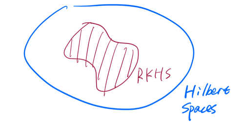

# Support Vector Machine
## Hard Margin SVM
Let's suppose that \((x_i, y_i)_{i=1,\cdots,n}\) is linearly separable (for motivation for now). Then there exists at least one \(\vec \beta, \beta_0\) s.t. \(\mathcal M_{\vec \beta, \beta_0} = \emptyset\). What we want is to find

$$
\begin{aligned}
\underset{(\vec \beta, \beta_{0})}{\operatorname{max}} &~margin(\vec \beta, \beta_0)\\
s.t. &~\mathcal M_{\vec \beta, \beta_0} = \emptyset
\end{aligned}
$$

where \(margin(\vec \beta, \beta_0):= min\{C^+_{\vec \beta, \beta_0}, C^-_{\vec \beta, \beta_0}\}\), 
\(C^+_{\vec \beta, \beta_0} = \underset{x_i \text{ s.t. } y_i = 1}{\operatorname{min}} dist(x_i, \mathcal H_{\vec \beta, \beta_0})\) and
\(C^-_{\vec \beta, \beta_0} = \underset{x_i \text{ s.t. } y_i = -1}{\operatorname{min}} dist(x_i, \mathcal H_{\vec \beta, \beta_0})\).

Let \(\tilde \beta = \frac{\vec \beta}{|| \vec \beta ||}\), \(\tilde \beta_0 = \frac{\beta_0}{|| \vec \beta ||}\), where \(||\tilde \beta || = 1\). Then we have \(\mathcal H_{\tilde \beta, \tilde \beta_0} = \mathcal H_{\vec \beta, \beta_0}\), \(\mathcal H^+_{\tilde \beta, \tilde \beta_0} = \mathcal H^+_{\vec \beta, \beta_0}\), and \(\mathcal H^-_{\tilde \beta, \tilde \beta_0} = \mathcal H^-_{\vec \beta, \beta_0}\). Thus, the *Geometric Formulation of SVM* is:

$$
\begin{aligned}
\underset{(\vec \beta, \beta_{0})}{\operatorname{max}} &~margin(\tilde \beta, \tilde \beta_0)\\
s.t. &~\mathcal M_{\tilde \beta, \tilde \beta_0} = \emptyset\\
&~||\tilde \beta|| = 1
\end{aligned}
$$

As \(dist(x, \mathcal H_{\tilde \beta, \tilde \beta_0}) = | <x, \tilde \beta> + \tilde \beta_0|\), 
we have \(margin(\tilde \beta, \tilde \beta_0) = \underset{i=1.\cdots,n}{\operatorname{min}} | <x_i, \tilde \beta> + \tilde \beta_0|\). 

As \(\mathcal M_{\tilde \beta, \tilde \beta_0} = \emptyset\), 
we have \(sign(<x_i, \tilde \beta> + \tilde \beta_0) = y_i\), \(\forall i=1, \cdots, n\).

Then, \(y_i (<x_i, \tilde \beta> + \tilde \beta_0) \geq 0\), \(\forall i=1,\cdots,n\). 

Thus, \(| <x_i, \tilde \beta> + \tilde \beta_0| = y_i (<x_i, \tilde \beta> + \tilde \beta_0)\), \(\forall i=1, \cdots, n\).

As a result, the margin becomes:

$$
\begin{aligned}
m &= \underset{i=1.\cdots,n}{\operatorname{min}} y_i(<x_i, \tilde \beta> + \tilde \beta_0)\\
&\qquad \qquad \Updownarrow\\
1 &= \underset{i=1.\cdots,n}{\operatorname{min}} y_i(<x_i, \frac{\tilde \beta}{m}> + \frac{\tilde \beta_0}{m})
\end{aligned}
$$

Let \(\beta = \frac{\tilde \beta}{m}\), \(\beta_0 = \frac{\tilde \beta_0}{m}\), 
then we also have \(1 \leq y_i(<x_i, \beta> + \beta_0)\), \(\forall i=1, \cdots, n\). 

As \(|| \beta || = || \frac{\tilde \beta}{m} || = \frac{1}{m}\), 
we have \(m = \frac{1}{|| \beta ||}\).

Thus, the geometric formulation of SVM becomes:

$$
\begin{aligned}
\underset{(\beta, \beta_{0})}{\operatorname{max}} &~\frac{1}{|| \beta ||}\\
s.t. &~y_i(<x_i, \beta> + \beta_0) \geq 1 ~\forall i=1,\cdots,n\\
&\qquad \qquad \Updownarrow\\
\underset{(\beta, \beta_{0})}{\operatorname{min}} &~|| \beta ||\\
s.t. &~y_i(<x_i, \beta> + \beta_0) \geq 1 ~\forall i=1,\cdots,n\\
&\qquad \qquad \Updownarrow\\
\underset{(\beta, \beta_{0})}{\operatorname{min}} &~|| \beta ||^2\\
s.t. &~y_i(<x_i, \beta> + \beta_0) \geq 1 ~\forall i=1,\cdots,n
\end{aligned}
$$

which is the *Convex Optimization Formulation of SVM*.

:::{.remark}

1. SVM problem is fessible only when data set is linearly separable.

2. SVM problem is a convex optimization problem.

:::

-----

**Duality for Convex Optimization**:

Primal problem *(P)*:

$$
\begin{aligned}
\underset{z\in R^s}{\operatorname{min}} &~f(z)\\
s.t. &~h_i(z) \leq 0 \text{ (constraints) }~\forall i=1,\cdots,n
\end{aligned}
$$

We first introduce the notion of Lagrangian: 

$$
\mathcal L(z, \lambda) = f(z) + \sum_{i=1}^n \lambda_i h_i(z)
$$

where \(\lambda \in R^n\), \(n\) is the number of constraints and \(\lambda = (\lambda_1, \cdots, \lambda_n)\) is the vector of Lagrangian multipliers.

Let \(g(h) = \underset{z\in R^s}{\operatorname{min}} ~\mathcal L(z, \lambda)\), where \(\lambda\) is fixed, then we have the *Dual Problem of (P) ((D))*:

$$
\begin{aligned}
\underset{\lambda}{\operatorname{max}} &~g(\lambda)\\
s.t. &~\lambda_i \geq 0 ~\forall i=1,\cdots,n
\end{aligned}
$$

Let's suppose that \(f:R^s \to R\) and \(h_i:R^s \to R\) are all differentiable and convex functions. Then,

$$
\begin{aligned}
\underset{\lambda \geq 0}{\operatorname{max}} g(\lambda) &= \underset{\lambda \geq 0}{\operatorname{max}} \underset{z\in R^s}{\operatorname{min}} \mathcal L(z,\lambda)\\
&= \underset{z\in R^s}{\operatorname{min}} \underset{\lambda \geq 0}{\operatorname{max}} \mathcal L(z,\lambda)\\
&= \underset{z\in R^s}{\operatorname{min}} f(z) ~(\text{suppose min and max can be swapped})\\
&\qquad s.t. ~h_i(z) \leq 0 ~\forall i=1,\cdots,n
\end{aligned}
$$

For the equation mentioned above:

$$
\underset{\lambda \geq 0}{\operatorname{max}} \mathcal L(z,\lambda) = \underset{\lambda \geq 0}{\operatorname{max}} f(z) + \sum_{i=1}^n \lambda_i h_i(z) = \begin{cases}\infty& \exists i, \text{ s.t. } ~h_i(z) > 0\\f(z) & \forall i, ~h_i(z) \leq 0\end{cases}
$$


:::{.theorem #KKT name="Karush-Kuhn-Tucker"}

- Suppose \(\exists \tilde z\), s.t. \(h_i(\tilde z) \leq 0\), \(\forall i=1,\cdots, n\) (Slatter's condition)

- Suppose \(f, h_i\) are differentiable and convex functions.

Then,  \(\forall z^*\) solution to *(P)*, \(\exists \lambda^*\) solution to *(D)*, s.t.

1. \(\vec 0 ~(\in R^s) = \nabla f(z^*) + \sum_{i=1}^n \lambda_i^* \nabla h_i(z^*)\) (Stationarity)

1. \(h_i(z^*) \leq 0\), \(\forall i=1,\cdots,n\) (Primal Feasibility)

1. \(\lambda_i^* \geq 0\), \(\forall i=1,\cdots,n\) (Dual Feasibility)

1. \(\lambda_i^* h_i(z^*) = 0\), \(\forall i=1,\cdots,n\) (Complementary Slackness)

Conversely, if \((z^*, \lambda^*)\) satisfy 1-4, then \(z^*\) is a solution to *(P)* and \(\lambda^*\) is a solution to *(D)*.
:::

-----

Back to **SVM** problem:

$$
\begin{aligned}
\underset{(\beta, \beta_{0})}{\operatorname{min}} &~\frac{|| \beta ||^2}{2}\\
s.t. &~y_i(<x_i, \beta> + \beta_0) \geq 1 ~\forall i=1,\cdots,n
\end{aligned}
$$

Let \(z = (\beta, \beta_0)\), \(f(z) = \frac{|| \beta ||^2}{2}\), \(h_i(z) = 1 - y_i(<x_i, \beta> + \beta_0)\).

Then we have \(\mathcal L(\beta, \beta_0, \lambda) = \frac{|| \beta ||^2}{2} + \sum_{i=1}^n \lambda_i \Big(1 - y_i(<x_i, \beta> + \beta_0)\Big)\) and \(g(\lambda) = \underset{(\beta, \beta_{0})}{\operatorname{min}} \{\frac{|| \beta ||^2}{2} + \sum_{i=1}^n \lambda_i \Big(1 - y_i(<x_i, \beta> + \beta_0)\Big)\}\)

Case 1: If \(\sum_{i=1}^n \lambda_iy_i \neq 0\), \(g(\lambda) = -\infty\)

Case 2: If \(\sum_{i=1}^n \lambda_iy_i = 0\), \(g(\lambda) = \underset{\beta}{\operatorname{min}} \{\frac{|| \beta ||^2}{2} + \sum_{i=1}^n \lambda_i \Big(1 - y_i(<x_i, \beta>)\Big)\}\).

To find this, we can find the critical point for the above problem: \(\vec 0 = \beta - \sum_{i=1}^n \lambda_i y_i x_i\). Thus, plug the \(\beta\) back to the above expression, we have: \(g(\lambda) = -\frac{1}{2} \sum_{i=1}^n \sum_{j=1}^n \lambda_i \lambda_j y_i y_j <x_i, x_j> + \sum_{i=1}^n \lambda_i\).

As a result, we have the Dual of SVM *(D)*: 

$$
\begin{aligned}
\underset{\lambda \geq 0}{\operatorname{max}} g(\lambda) &= \underset{\lambda \in R^n}{\operatorname{max}} \{-\frac{1}{2} \sum_{i=1}^n \sum_{j=1}^n \lambda_i \lambda_j y_i y_j <x_i, x_j> + \sum_{i=1}^n \lambda_i \}\\
&\qquad s.t. ~
\begin{cases}\sum_{i=1}^n \lambda_iy_i = 0\\
\lambda_i \geq 0
\end{cases}~\forall i=1,\cdots,n
\end{aligned}
$$

Now, using KKT conditions: let \(\lambda^*\) be a solution to *(D)*. From the (Stationarity), we have \(\beta^* = \sum_{i=1}^n \lambda_i^* y_i x_i\). From the (Complementary Slackness), we have

$$
\begin{aligned}
&\lambda_i^*\Big(1-y_i(<x_i, \beta^*> + \beta_0^*)\Big) = 0,  ~\forall i\\
\underset{\text{choose } \hat{i} \text{ s.t. } \lambda^*_{\hat{i}} > 0}{\Rightarrow} &~ 1 - y_{\hat i} (<x_{\hat i}, \beta^*> + \beta_0^*) = 0\\
\Rightarrow &~ 1 = y_{\hat i} (<x_{\hat i}, \beta^*> + \beta_0^*)\\
\underset{y_i^2=1}{\Rightarrow} &~ y_{\hat i} = (<x_{\hat i}, \beta^*> + \beta_0^*)\\
\Rightarrow &~ (y_{\hat i} - <x_{\hat i}, \beta^*>) = \beta_0^*
\end{aligned}
$$

Then, we go from \(\lambda^*\) to \((\beta^*, \beta_0^*)\) or *(D)* to *(P)*:

$$
\begin{aligned}
\beta^* &= \sum_{i=1}^n \lambda_i^* y_i x_i\\
\beta_0^* &= y_{\hat i} - <x_{\hat i}, \beta^*>\\
&= y_{\hat i} - \sum_{j=1}^n \lambda_j^* y_j <x_j, x_{\hat i}>, \text{ where } \hat{i} \text{ s.t. } \lambda^*_{\hat{i}} > 0
\end{aligned}
$$

One can show that the primal problem *(P)* has a unique solution as shown above (Use strictly convex to show uniqueness for \(\beta^*\)).

Thus the classifier is:

$$
\begin{aligned}
l(x)&= 
\begin{cases}
1 & <\beta^*, x> + \beta_0^* > 0\\
-1 & <\beta^*, x> + \beta_0^* < 0
\end{cases}\\
&= 
\begin{cases}
1 & \sum_{j=1}^n \lambda_j^* y_j (<x_j, x> - <x_j, x_i>) + y_i > 0\\
-1 & o.w.
\end{cases}, \text{ where }i \text{ s.t. } \lambda_i^*>0\\
\end{aligned}
$$

which depends on \(x\) and \(x_i\) only through inner products. This is a crucial property that we will exploit to define a larger class of SVM classifiers.

:::{.remark}

1. Hard Margin SVM problem has a solution (primal problem is feasible) if data is linearly separable .

2. In KKT, primal problem is feasible iff dual problem is bounded (in which case both primal and dual have solution and it makes sense to talk about \(z^*\) and \(\lambda^*\)).
:::

:::{.definition #SV name="Support Vectors"}
Under the assumptions, let  \(\beta^*, \beta_0^*, \lambda^*\) be the solution to *(P)*. We say \(x_i\) is a support vector if \(y_i (<x_i, \beta^*> + \beta_0^*) = 1\).
:::

In particular, the minimum distance between \(\{x_1, \cdots, x_n\}\) and the optimal hyperplane \(\mathcal H_{\beta^*, \beta_0^*}\) is achieved at the support vectors.

:::{.theorem #SPofSVM name="Stability Property of SVMs"}
Let \(x_i\) be a training data point and not a support vector. Suppose \(x_i\) is changed for a point \(\tilde x_i\) s.t. \(y_i (<x_i, \beta^*> + \beta_0^*) \geq 1\). Then the solution for the new data set is the same for the original data set.
:::

:::{.proof}
\((\lambda^*, \beta_0^*, \beta^*)\) from the original problem still satisfy KKT condition for new data set:

1. (Stationarity) As \(x_i\) is not a support vector, we have \(\lambda^*_i = 0\). Thus, \(\beta^* = \sum_{j=1}^n \lambda_j^* y_j x_j = \sum_{j \neq i} \lambda_j^* y_j x_j + \lambda_i^* y_i x_i = \sum_{j \neq i} \lambda_j^* y_j x_j + \lambda_i^* y_i \tilde x_i\), which means that \(\beta^*\) doesn't change. 

2. (Primal Feasibility) \(y_j (<\beta^*, x_j> + \beta_0^*) \geq 1\), \(\forall j \neq i\) and \(y_i (<\beta^*, x_j> + \beta_0^*) \geq 1\) by the assumption above.

3. (Dual Feasibility) \(\lambda_j \geq 0\), \(\forall j\).

4. (Complementary Slackness) As \(\lambda_i^* = 0\), \(\lambda_i^* (1-y_i(<\tilde x_i, \beta^*> + \beta_0^*)) = 0\).

As we didn't change any \(y_i\), we still have \(\sum_{j=1}^n \lambda_i^* y_i = 0\). As a result, \((\beta_0^*, \beta^*)\) is still a solution for the primal problem for the new data set.
:::

:::{.remark}
The robustness associated to SVMs is markedly different to what happens with LDA or Logistic Regression, where outliers can change completely the decision boundaries. It depends only on support vectors.
:::

## Soft Margin SVM

What if the data set is not linearly separable?

### Case 1

```{r smSVM1, message=F, warning=F, echo=F}
library(tidyverse)
library(patchwork)
example = data.frame(x = rep(1:4, each = 3),
                     y = rep(1:3, 4), 
                     cols = rep(c(-1,1), each=6))
example$cols[5] = 1
p1 = example %>% ggplot() +
  geom_point(aes(x, y, color = factor(cols))) +
  geom_abline(intercept = -4.3, slope = 2.5, color = "black") + 
  labs(x="", y="", color = "class") +
  ggtitle("hyperplane 1")

p2 = example %>% ggplot() +
  geom_point(aes(x, y, color = factor(cols))) +
  geom_vline(aes(xintercept = 2.5), color = "black") + 
  labs(x="", y="", color = "class") +
  ggtitle("hyperplane 2")

p1+p2 + plot_layout(guides = "collect")
```

The data set is not linearly separable mildly. This case will motivate the soft margin SVM (generalizes Hard Margin SVM).

$$
\begin{aligned}
\underset{\beta_0, \beta, \xi_1, \cdots, \xi_n}{\operatorname{min}} &~\frac{|| \beta ||^2}{2} + C \sum_{i=1}^n \xi_i\\
s.t. &~
\begin{cases}
y_i(<x_i, \beta>) \geq 1 - \xi_i\\
\xi_i \geq 0
\end{cases}, ~\forall i=1,\cdots,n
\end{aligned}
$$

where \(C\) is a parameter of the problem: as \(C \nearrow \infty\) we recover the hard margin problem (in case the data is linearly separable). However, for \(C \in (0, \infty)\), the problem is always feasible.

### Case 2

```{r smSVM2, message=F, warning=F, echo=F}
radius1 <- 5
radius2 <- 3
center_x <- 0
center_y <- 0
num_points <- 20

theta <- seq(0, 2 * pi, length.out = num_points)
x1 <- center_x + radius1 * cos(theta)
y1 <- center_y + radius1 * sin(theta)
x2 <- center_x + radius2 * cos(theta)
y2 <- center_y + radius2 * sin(theta)
circle_points <- data.frame(x1, y1, x2, y2)

ggplot(circle_points) +
  geom_point(aes(x1, y1, col=factor(1))) +
  geom_point(aes(x2, y2, col=factor(-1))) +
  coord_fixed() + 
  labs(x="", y="", color = "class")
```

The data set is not linearly separable but by a lot. After a transformation, we will be able to transform the data into a linearly separable data set.

Let $\begin{aligned}\psi: R^2 &\to \mathcal H( = R^3)\\(x,y) &\to (x,y,x^2+y^2)\end{aligned}$. Then the data set \((\psi(x_1), y_1), \cdots, (\psi(x_n), y_n)\) is now linearly separable, and we will work on the embedded space:

*(P)*: 

$$
\begin{aligned}
\underset{\beta_0 \in R, \beta \in \mathcal H}{\operatorname{min}} &~\frac{|| \beta ||_{\mathcal H}^2}{2}\\
s.t. &~y_i(<\beta, \psi(x_i)>_{\mathcal H}) \geq 1, ~\forall i=1,\cdots,n
\end{aligned}
$$

*(D)*:

$$
\begin{aligned}
\underset{\lambda \in R^n}{\operatorname{max}} &~ -\frac{1}{2} \sum_{i=1}^n \sum_{j=1}^n \lambda_i \lambda_j y_i y_j <\psi(x_i), \psi(x_j)>_{\mathcal H} + \sum_{i=1}^n \lambda_i\\
&s.t. ~
\begin{cases}\sum_{i=1}^n \lambda_iy_i = 0\\
\lambda_i \geq 0
\end{cases},~\forall i=1,\cdots,n
\end{aligned}
$$

- From \(\lambda^*\), we can obtain \(\beta^* = \sum_{j=1}^n \lambda_j^* y_j \psi(x_j)\)

- Given \(i\) s.t. \(\lambda_i^* > 0\), \(\beta_0^*\) can then be computed: \(\beta_0^* = y_i - <\beta^*, \psi(x_i)>_{\mathcal H} = y_i - \sum_{j=1}^n \lambda_j^* y_j <\psi(x_j), \psi(x_i)>_{\mathcal H}\).

- The classifier is (\(x \in R^d\)):

$$
\begin{aligned}
l_{\psi}(x):&=
\begin{cases}
1 & <\beta^*, \psi(x)>_{\mathcal H} + \beta_0^* > 0\\
-1 & <\beta^*, \psi(x)>_{\mathcal H} + \beta_0^* < 0
\end{cases}\\
&= \begin{cases}
1 & \sum_{j=1}^n \lambda_j^* y_j (<\psi(x_j), \psi(x)>_{\mathcal H} - <\psi(x_j), \psi(x_i)>_{\mathcal H}) + y_i > 0\\
-1 & o.w.
\end{cases}\\
\end{aligned}
$$

where \(i\) s.t. \(\lambda_i^* > 0\), and \(\lambda_j^*\) only depends on \(<\psi(x_j), \psi(x_l)>_{\mathcal H}\)


Let \(K(x, \tilde x) = <\psi(x), \psi(\tilde x)>_{\mathcal H}\) for arbitrary \(x, \tilde x \in R^d\). Then the only thing we need to build \(l_\psi\) is the function \(K\). In particular, we don't need \(\psi\) explicitly. Thus, it is fair to write \(l_\psi = l_K\).

In particular, to produce more general SVM classifiers, we can either:

1. Pick a "Hilbert Space" \(\mathcal H\) and define a map \(\psi: R^d \to \mathcal H\), then we can build the function \(K\), which is all we need to compute \(l_\psi\).

2. Pick a "Kernel" \(K\) and produce the classifier \(l_K\).

Question: If we start with a "Kernel" \(K\), can we implicitly picking \(\mathcal H\) and \(\psi\)?

Answer: Under fairly general condition, yes.

:::{.definition #kernel name="Kernels"}
A kernel over a set \(\mathcal X\) is a function \(K: \mathcal X \times \mathcal X \to R\) with the following property:

\(\forall n \in N\) and \(\forall\) sequence of points \(x_1, \cdots, x_n \in \mathcal X\), the matrix 

$$
A:= 
\left(
\begin{matrix} K(x_1,x_1) & \cdots & K(x_1, x_n)\\
\vdots & \ddots & \vdots\\
K(x_n ,x_1) & \cdots & K(x_n, x_n)
\end{matrix}
\right)
$$

is symmetric (\(A = A^T\)) and positive semi-definite \(<Av, v>_{R^n} \geq 0\), \(\forall b \in R^n\).
:::

:::{.remark}

1. Kernels must be symmetric functions: \(K(x,y) = K(y,x)\), \(\forall x,y \in \mathcal X\).

2. But there are symmetric functions that are not kernels. In particular, we need to check the positive semi-definiteness condition.
:::

:::{.proposition}
1. Inner products are kernels: \(K(x, y) = <x,y>_{R^d}\).

2. If \(K_1: \mathcal X \times \mathcal X \to R\) and \(K_2: \mathcal X \times \mathcal X \to R\) are two kernels, then \(K(x,y):= a_1 K_1(x,y) + a_2 K_2(x,y)\) is also a kernel, provided \(a_1, a_2\) are two non-negative numbers.

3. If \(K: \mathcal X \times \mathcal X \to R\) is a kernel and \(f:\mathcal X \to R\) is a function, then \(\tilde K(x,y) := f(x) \cdot f(y) \cdot K(x,y)\) is also a kernel.

4. If \(K_1: \mathcal X \times \mathcal X \to R\) and \(K_1: \mathcal X \times \mathcal X \to R\) are two kernels, then \(K(x,y) := K_1(x,y) \cdot K_2(x,y)\) is also a kernel.
:::

:::{.proof} 
(of 1)

Let \(n \in N\) and \(x_1, \cdots, x_n \in R^d\) be arbitrary. Consider the matrix \(A \in R^{n \times n}\) with entries \(A_{ij} = <x_i, x_j>_{R^d}\), then

- It is symmetric: \(A_{ij} = <x_i, x_j>_{R^d} = <x_j, x_i>_{R^d} = A_{ji}\)

- It is positive semi-definite:  
Let \(v = (v_1, \cdots, v_n) \in R^n\). Then  
$$
\begin{aligned}
<Av, v>_{R^d} &= \sum_{i=1}^n \sum_{j=1}^n A_{ij} v_i v_j\\
&= \sum_{i=1}^n \sum_{j=1}^n <x_i, x_j>_{R^d} v_i v_j\\
&= \sum_{i=1}^n \sum_{j=1}^n <v_i x_i, v_j x_j>_{R^d}\\
&= <\sum_{i=1}^n v_i x_i, \sum_{j=1}^n v_j x_j>_{R^d}\\
&= || \sum_{i=1}^n v_i x_i ||^2_{R_d}\\
&\geq 0
\end{aligned}
$$

:::

By the above proof, we can build the kernel \(K(x,y) = <\psi(x), \psi(y)>_{\mathcal H}\) given \(\mathcal H\) and \(\psi :R^d \to \mathcal H\).

:::{.corollary}
The following are kernels in \(R^d\):

1. Inner product: \(K(x,y) = <x,y>_{R^d}\).

2. Polynomial: \(K(x,y) = a_0 + a_1 <x,y>_{R^d} + \cdots + a_l (<x,y>_{R^d})^l\) as long as \(a_0, \cdots, a_l \geq 0\). (\((<x,y>_{R^d})^l\) is a kernel)

3. Radial Basis Kernel or Gaussian Kernel: \(K(x,y) = \operatorname{exp} (-\frac{|| x-y ||^2}{\sigma})\) for \(\sigma > 0\).
:::

:::{.remark}

1. For every kernel we will have a different classification rule. Try the simplest classifiers first (linear classifiers or soft margin SVMs).

2. Any classifier that can be purely defined in terms of inner products can be kernelized.

3. For a given kernel, how do we know if the embedded data set \((\psi(x_1), y_1), \cdots, (\psi(x_n), y_n)\) is linearly separable? In some cases it is always the case. But even if the data set is not linearly separable, we may be in the Case 3 mentioned below, where we should use the kernelized version of SVMs.
:::

:::{.definition #HS name="Hilbert Space"}
A Hilbert Space is a *vector space* (1) \(\mathcal H\) together with an *inner product* (2) \(<\cdot, \cdot>_{\mathcal H}\), under which \(\mathcal H\) is a *complete* (3) metric space.

- Vector Space: We can add together objects in \(\mathcal H\) and multiply by scales (\(v, \tilde v \in \mathcal H\), then \(av + \tilde v \in \mathcal H\)).

- Inner Product:   
  - \(<f,g>_{\mathcal H} = <g,f>_{\mathcal H}\) (symmetry)  
  - \(<af + b\tilde f, g>_{\mathcal H} = a<f,g>_{\mathcal H} + b<\tilde f, g>_{\mathcal H}\) (linear in each entry)  
  - \(|| f ||^2_{\mathcal H} := <f, f>_{\mathcal H} \geq 0\), \(\forall f\in \mathcal H\). And \(<f, f>_{\mathcal H} = 0 \Leftrightarrow f = 0\).
  
- Completeness: An inner product induces a norm and thus a metric: \(||f-g||^2_{\mathcal H} := <f-g, f-g>_{\mathcal H}\). Under this metric, \(\mathcal H\) must be a complete metric space.
:::

- Properties of Hilbert Space (Cauthy-Schwartz Ineq): \(|<f,g>_{\mathcal H}| \leq ||f||_{\mathcal H} ||g||_{\mathcal H}\), \(||f||_{\mathcal H}:= \sqrt{<f, f>_{\mathcal H}}\).

:::{.example}

1. Basic example: \((R^m, <\cdot, \cdot>_{R^m})\)

2.  The space of "square integrable measurable function" defined on R: \(\mathcal L^2(R) := \{f \text{ measurbale s.t. } \int_R f^2dx < \infty\}\).  
Note: \(\mathcal L^2(R)\) is not correctly defined as above, and in fact one has to work with "equivalent classes". So for the example, a measurable function \(f\) is identified with another function \(\tilde f\) if \(f = \tilde f\) a.e. (almost everywhere).  
In any cases, with this technical detail in mind: \(<f,g>_{\mathcal L^2(R)} := \int_R fg ~dx\).

3. RKHS (Reproducing Kernel Hilbert Spaces):  
```{r RKHS,echo=F, fig.align='center', fig.pos="ht", out.width = "70%"}

```
:::

:::{.definition #cont name="Continuous"}
Let \(\mathcal H\) be Hilbert Space, then a linear function \(L: \mathcal H \to R\) is *continuous* if there is a constant \(C\) s.t \(|L(f)| \leq C ||f||_{\mathcal H}\), \(\forall f \in \mathcal H\).
:::

:::{.example}
Fix \(g \in \mathcal H\) and define \(L_g(f) := <f,g>_\mathcal H\). Then \(L_g\) is linear and continuous:

\(L_g(f + a\tilde f) = <f+a\tilde f, g>_\mathcal H = <f,g>_\mathcal H + a<\tilde f, g>_\mathcal H = L_g(f) + aL_g(\tilde f)\).
And by Cauthy-Schwartz Ineq, we have \(|L_g(f)| = |<f,g>_\mathcal H| \leq ||g||_\mathcal H \cdot ||f||_\mathcal H\), \(\forall f \in \mathcal H\).
:::

:::{.theorem #RRT name="Riesz Representation Theorem"}
If \(\mathcal H\) is a Hilbert Space and \(L:\mathcal \to R\) is linear and continuous, then \(\exists\) a unique \(g \in \mathcal H\) s.t \(L(f) = L_g(f)\), \(\forall f \in \mathcal H\).
:::

:::{.definition #RKHS name="Reproducing Kernel Hilbert Space"}
Let \(\mathcal X\) be a set, \(\mathcal H\) be a Hilbert Space of real valued functions \(f: \mathcal X \to R\) (i.e. elements in \(\mathcal H\) are functions from \(\mathcal X\) into \(R\)). \(\mathcal H\) is said to be a RKHS if \(\forall x \in \mathcal X\), the "evaluation map" \(L_x: f \in \mathcal H \to f(x) \in R\) is a linear and continuous map. In particular, \(|f(x) - \tilde f(x)| \leq C_x || f - \tilde f ||_\mathcal H\), \(\forall f, \tilde f\).
:::

**Why "Reproducing Kernel"?**:

\(L_x\) is clearly linear, and if in addition it is continuous, then by **Theorem \@ref(thm:RRT)**, \(\exists\) a unique \(K_x \in \mathcal H\) s.t \(f(x) = L_x(f) = <f, K_x>_\mathcal H\), \(\forall f \in \mathcal H\). That is, to evaluate \(f\) at \(x\), it is enough to take the inner product of \(f\) with \(K_x\).

Now, let \(\tilde x \in \mathcal X\), then \(K_{\tilde x} (x) = <K_{\tilde x}, K_x>_\mathcal H\). Let's call them \(K(\tilde x, x)\). Then the function \(K\) defined above is a kernel: take \(\psi: \begin{matrix} \mathcal X \to \mathcal H\\x \to K_x\end{matrix}\), then \(K(\tilde x, x) = <K_{\tilde x}, K_x>_\mathcal H = <\psi(\tilde x), \psi(x)>_\mathcal H\).

So far, we have gone from RKHS to Kernel (\(K\)). And the Kernel \(K\) has the reproducing property: \(<f, K(\cdot, x)>_\mathcal H = f(x)\), \(\forall f\).

How about we go from Kernel (\(K\)) to RKHS?

:::{.theorem #MAT name="Moore-Aronszjan Theorem"}
Let \(K\) be a kernel defined on \(\mathcal X\). Define 

$$
\begin{aligned}
\mathcal H = \Big \{\sum_{i=1}^\infty a_i K(\cdot, x_i): &\text{for some colletcion }a_i \in R, x_i \in \mathcal X \\
&\text{with } \sum_{i,j}a_i a_j K(x_i, x_j) < \infty\Big \}
\end{aligned}
$$

and 

$$
<\sum_{i=1}^\infty a_i K(\cdot, x_i), \sum_{j=1}^\infty b_j K(\cdot, y_j)>_\mathcal H := \sum_{i=1}^\infty\sum_{j=1}^\infty a_i b_j K(x_i, y_j).
$$

Think of this as \(a^T K b\) where \(a = (a_1, \cdots)^T\), \(b = (b_1, \cdots)^T\), \(K = \left( \begin{matrix}K(x_1,y_1) & \cdots\\\vdots & \ddots \end{matrix}\right)\).

It can be shown that \(\mathcal H\) with this inner product is a Hilbert Space and \(K\) is a reproducing kernel. 
:::

:::{.proof}
Let \(f \in \mathcal H\), \(f = \sum_{i=1}^\infty a_i K(\cdot, x_i)\). Then, \(<f, K(\cdot, x)>_\mathcal H = <\sum_{i=1}^\infty a_i K(\cdot, x_i), K(\cdot, x)> = \sum_{i=1}^\infty a_i K(x, x_i) = f(x)\).
:::


### Case 3

```{r smSVM3, message=F, warning=F, echo=F}
radius1 <- 5
radius2 <- 3
center_x <- 0
center_y <- 0
num_points <- 20

theta <- seq(0, 2 * pi, length.out = num_points)
x1 <- center_x + radius1 * cos(theta)
y1 <- center_y + radius1 * sin(theta)
x2 <- center_x + radius2 * cos(theta)
y2 <- center_y + radius2 * sin(theta)
circle_points <- data.frame(x1, y1, x2, y2,
                            cols1 = rep(1, num_points),
                            cols2 = rep(-1, num_points))
circle_points$cols1[c(5,10)] = c(-1,-1)

ggplot(circle_points) +
  geom_point(aes(x1, y1, col=factor(cols1))) +
  geom_point(aes(x2, y2, col=factor(cols2))) +
  coord_fixed() + 
  labs(x="", y="", color = "class")
```

Use the kernelized version of Soft Margin SVM.


